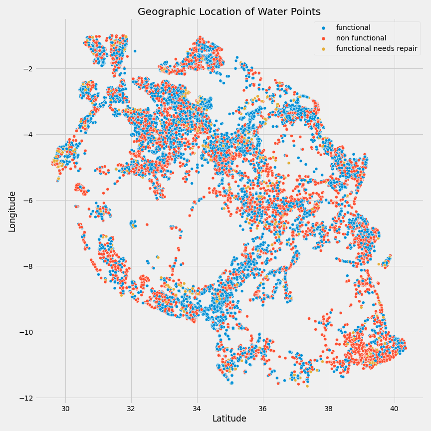
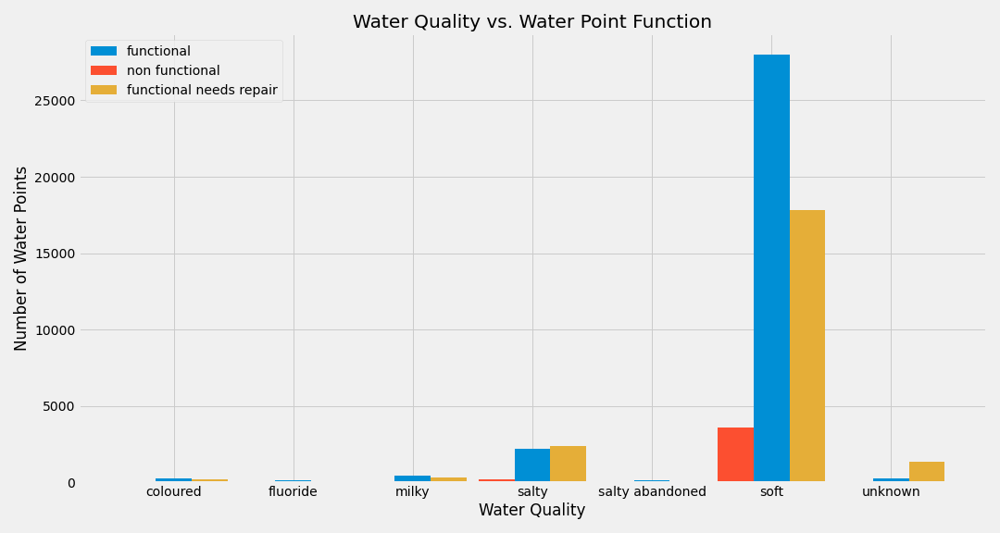
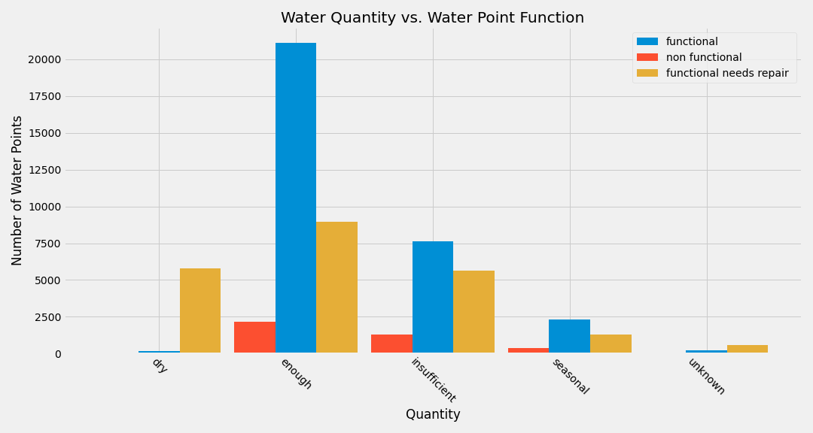

# Water we Doing!?

**Authors:** Victor Chen, Aaron Cherry 

## Repo Table of Contents

- [Notebooks](Notebooks/)
    - [Working Notebooks](Notebooks/working_notebooks/) Notebooks with raw code
    - [Final Notebook](Notebooks/final_notebook/) Final Notebook with full technical description of the analysis
- [src](src/) Python Files with functions used in the Final Notebook
- [Images](images/) List of images used in the final slide deck and summary below
- [Data](data/) Contains the data used in the analysis
- [GeoJson Files](geojson_files/) Map Files
- [Presentation Slides](slidedeck/)

## Overview

With this analysis, we aim to predict the condition of waterwells in Tanzania based on data retreived from the Taarifa waterpoints dashboard. The dashboard aggregates information collected from the Tanzania Ministry of Water.

## Business Problem

A major challange of the Tanzanian Ministry of Water is determining when, where and how often a water well in Tanzania would need repairs. Implementation of models to predict the condition of a water well would greatly enhance maintenance operations, provide crucial updates associated with the conditions of the water wells and ensure that clean water sources can be provided to the communities in Tanzania. Through this analysis, we aim to provide prediction models based on the information collected to determine water well conditions to aid the Tanzanian Ministry of Water.

## Data Understanding

The data used for this analysis is taken from the Taarifa waterpoints dashboard that functions to aggregate weter well data collected from the Tanzania Ministry of Water. A link to the data and explanation of the features found in the data can be found [here](https://www.drivendata.org/competitions/7/pump-it-up-data-mining-the-water-table/page/23/). A link to the Taarifa waterpoints dashboard website can be found [here](https://taarifa.org/). The link to the website for the Tanzania Ministry of Water can be found [here](https://www.maji.go.tz/).

A complete list and description of the features used can be found in the [final notebook]().

The target class in the data set is ```status_group``` and consists of three classes. The classes and their descriptions can be fouind in the table below:

|Label|Description|
|:-----|:------|
|```functional``` | the waterpoint is operational and there are no repairs needed|
|```functional needs repair``` | the waterpoint is operational, but needs repairs|
|```non functional``` | the waterpoint is not operational|

## Exploratory Data Analysis



The Following Key Features were found to have a large impact on the prediction of Water point condition:

- **Water Quality** The graph below shows the water quality as it relates to the water point condition. There seems to be a relationship btw the function of the water point and the water wuality as the ```soft``` quality has a much larger ratio of functional and non functional water points than ```salty```.



- **Water Quantity** There does seem to be some correlation btw the quantity of the water and the fonction of the water point. This is shown by the larger ratio of functioning water points to non functioning water points when the point is providing ```enough``` water.



- **Water Pump Type** There does seem to be some correlation btw the water point type and the function as the ratio of functional to non functional for ```standpipe``` is much larger than the ratio for ```hand pump```. As the standpipe configuration might be less complex, there could be less failure modes for the ```standpipe``` configuration.


- **Location of the Pump** The map above does show a few regions such as the area around the capitol and the lower east region that have a higher percentage of non functional pumps. These locations probably receive a large volume of people and are prone to wear and tear.


## Modeling

All models incorporate One Hot Encoding teh categorical data dropping the first column, Standard Scaling for all of the continuous variables, and SMOTE with the ```sampling_strategy``` set to 'minority' to properly oversample the minority class of ```functional needs repair```.
Among the models tested (see the [final notebook]() for examples) the RandomForest model performed the best interms of accuracy, however did not perform as well in terms of the macro precision (KNN did better). We went with the Random Forest as our baseline model as it is simpler to emplement and easier to optimize. Future work might include an ensemble including Random Forest and KNN.

The accuracy and precision scores for the baseline, and optimal model can be found in the table below. The optimized model performed slightly better and enjoyed a 1% increase in macro precision and accuracy relative to the base model.

|Model| Precision| Accuracy|
|:-----:|:-------:|:--------:|
|Baseline| 0.68| 0.78|
|Optimized| 0.69| 0.79|

## Conclusions

**1. EDA** From the preliminary exploritory data analysis we found that the conition of the water well depends heavily on the type of water well, the amount of water being pulled from the point, the quality of water that it serves and the location/surrounding population of the water point

**2. Model** We found that the optimal model to give the best predictions was a Random Forest model which gave a 79% accuracy rate and a 69% precision rate meaning that this model will accurately predict the water point condition 79 times out of 100 and the model was optimized to limit the amouint of false positives or the possibility of predicting a well as functional when in reality it is not.

**3. Best Features** The features importances shows that the most importtant features in modeling and predicting the condition of a water point are the geographic location, the water point type, and the water quility at the point. This aligns with the exploratory data analysis done in the preceding section.

## Next Steps

Further analysis can be done to better predict the condition of a water point. The following are some suggestions for future iterations:

**1. Better Data** A large portion of the data were missing location, population, water yeild, and construction year. As is is likely that the condition of the pump would heavily rely on the age, amount of usage, and location of the water point, the lack in data should be addressed before more iterations can be made.

**2. New Data** Information such as the date of last repair, the failure mode if non functional, average climaate information, and frequency of maintenance could be very influential in predicting the condition of the water point and could lead to a time sequenced prediction method.

**3. Time Sequence** It would be most interesting and perhaps most important to be able to pedict when a water point would need maintenance and the frequency of mainteneance required for a water point. Future iterations should be focussed on these kinds of predictions as they will be influential in defining maintenance routines.

## Authors

Aaron Cherry
- Email: cherrya050@gmail@.com
- Github: https://github.com/JCherryA050
- Linkedin: https://www.linkedin.com/in/aaron-cherry-8aa728124/

Victor Chen
- Email: victor.i.chen.98@gmail.com
- Github: https://github.com/vchen-98
- Linkedin: https://www.linkedin.com/in/victorchen98/

## Repo Structure
```
├── Notebooks
│   ├── final_notebook.ipynb
│   |   └── final_notebook.ipynb
│   └── student.ipynb
│       ├── notebook_template.ipynb
│       └── vc_technical.ipynb
|
├── data
│   ├── water_well_test.csv
│   ├── water_well_training_labels.csv
│   └── water_well_training_values.csv
|
├── geojson_files
│   ├── TZA_adm1_mkoaTZ.geojson
│   ├── gadm36_TZA.gpkg
│   └── license.txt
|
├── images
│   ├── Coat_of_arms_of_Tanzania.svg.png
│   ├── altitude.png
│   ├── extraction_type.png
│   ├── feature_importance.png
│   ├── hand-pump.jpg
│   ├── population.png
│   ├── pumping.jpg
│   ├── pumping_new.jpg
│   ├── satellite_map.PNG
│   ├── standpipe.jfif
│   ├── status_group.png
│   ├── taariflogo.png
│   ├── tanzania_map.png
│   ├── water_amount.png
│   ├── water_quality.png
│   ├── water_quantity.png
│   ├── well_function_location.png
│   ├── well_type.png
│   └── wp_type.png
|
├── slidedeck
│   └── final_presentation_phase3.pdf
|
├── src
│   └── eda.py
|
├── .gitignore
└── README.md
```
